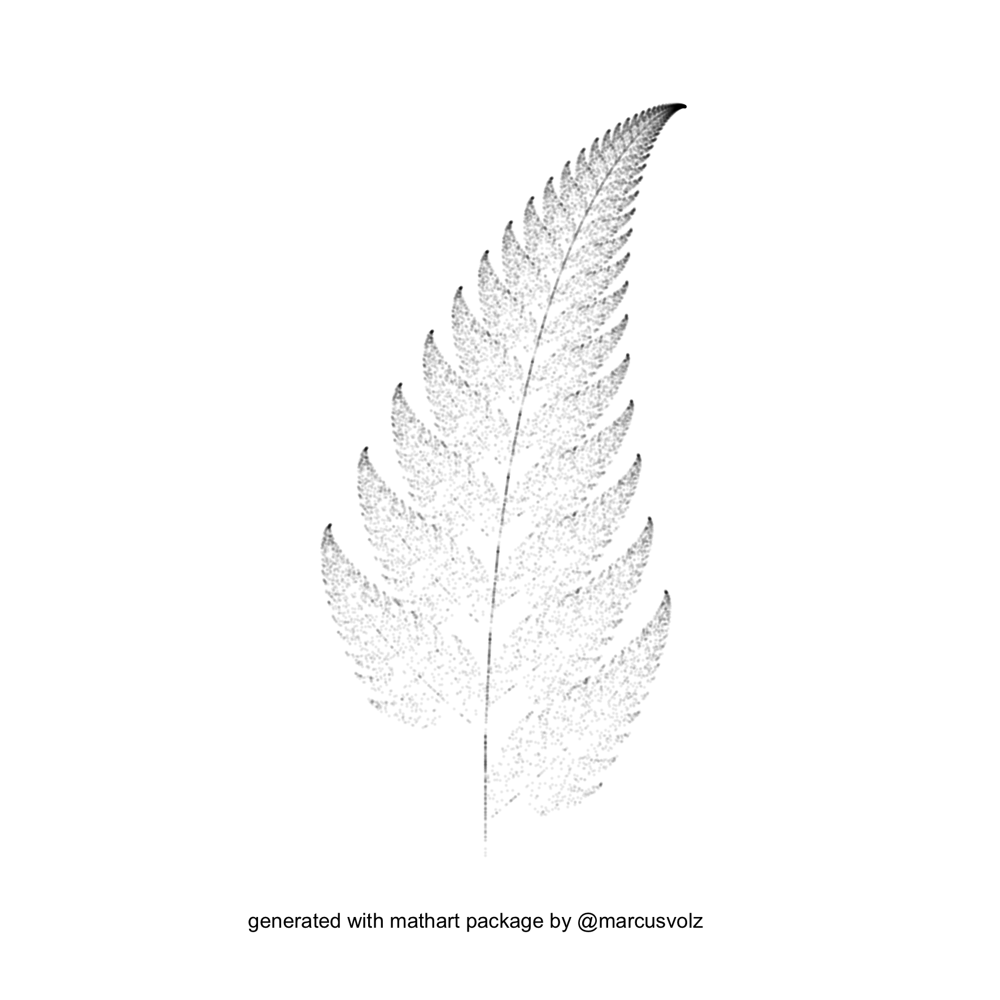

```{r eval = FALSE, echo = F}
knitr::knit(input = "~/Dropbox/gitpitch/PITCHME.Rmd", output = "~/Dropbox/gitpitch/PITCHME.md")

system("
git add --all
git commit -m 'update'
git push -u origin master
")
```

## SOURCE

- [slide](https://gitpitch.com/KeachMurakami/gitpitch_materials#/)
- [markdown](https://github.com/KeachMurakami/gitpitch_materials/blob/master/PITCHME.md)
- external files
    - [PITCHME.yaml](https://github.com/KeachMurakami/gitpitch_materials/blob/master/PITCHME.yaml)
    - [override css](https://github.com/KeachMurakami/gitpitch_materials/blob/master/css/PITCHME.css)


---?color=linear-gradient(to left, #56ccf2, #2f80ed)
<!-- .slide: class="center" -->

Geometry

+++

`r yose::draw_grid()`


---?color=linear-gradient(to left, #56ccf2, #2f80ed)
<!-- .slide: class="center" -->

Layout

+++

two column

```
<div class="column1">
LEFT SIDE
</div class="column1">

<div class="column2">
RIGHT SIDE
</div class="column2">
```

<div class="column1">
LEFT SIDE
</div class="column1">

<div class="column2">
RIGHT SIDE
</div class="column2">

+++

fixed horizontal element

```
<div style="position:absolute; top=700px; heigth:200px; color:white; background-color:orange">
Fixed Footer Text
</div>
```

<div style="position:absolute; top=700px; heigth:200px; color:white; background-color:orange">
Fixed Footer Text
</div>

---?color=linear-gradient(to left, #56ccf2, #2f80ed)
<!-- .slide: class="center" -->

Image

+++

override css

```css
.reveal section img {
  border: 0;
  box-shadow: none;
  margin: 1px;
}
```

+++

fixed position (demo)

<div style="position:relative; left:0px; top:0px; width:500px; height:500px">
<div class="fragment" data-fragment-index = "1" style="position:absolute; left:0px; top:0px; width:100%; height:100%">

</div>
<div class="fragment" data-fragment-index = "2" style="position:absolute; left:0px; top:0px; width:100%; height:100%">

</div>
</div>

+++

fixed position (code)

```
<div style="position:relative; left:0px; top:0px; width:500px; height:500px">
<div class="fragment" data-fragment-index = "1" style="position:absolute; left:0px; top:0px; width:100%; height:100%">
# 
</div>
<div class="fragment" data-fragment-index = "2" style="position:absolute; left:0px; top:0px; width:100%; height:100%">
# 
</div>
</div>
```

@[1, 8](generate fixed rectangle)
@[2-4](display the first plot using ‘fragment’)
@[5-7](display the second plot using ‘fragment’)

+++

resize (demo)

<div class="column1">

</div>
<div class="column2">

</div>

+++

resize (code)

```
<div class="column1">
# 
</div>
<div class="column2">
# 
</div>
```

- <small>`r htmltools::HTML("@fa[thumbs-up]")`: ``</small>

- <small>`r htmltools::HTML("@fa[thumbs-down]")`: `{width=20%}`</small>


---

REFERENCES
<!-- .slide: class="center" -->
